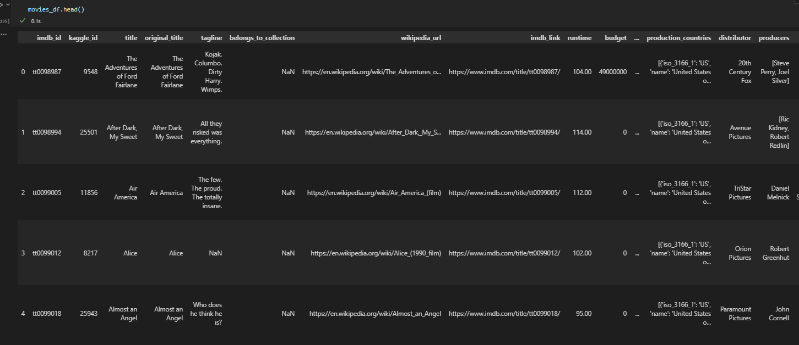
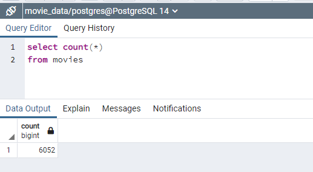
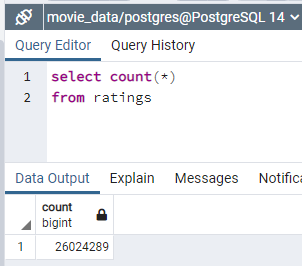

# Movies-ETL

Amazing Prime is trying to develop an algorithm to help them predict which low cost movies will be hits. They are organizing a hackathon to bring together a bunch of programmers who can help develop this algorithm.

Britta, an Amzing Prime team member, is excited to prepare for the hackathon. In data analysis, a hackathon is an event where teams of analysts collaborate to work intensively on a project, using data to solve a problem. Hackathons generally last several days, and teams work around the clock on their projects.

Britta needs to gather data from both Wikipedia and Kaggle, combine them, and save them into a SQL database so that the hackathon participants have a nice, clean dataset to use.

To do this, she will follow the ETL process: extract the Wikipedia and Kaggle data from their respective files, transform the datasets by cleaning them up and joining them together, and load the cleaned dataset into a SQL database.

## Overview of Data

### Wikipedia Movie data

Wikipedia has a ton of information about movies, this information includes the following:

- budgets 
- box office returns
- cast 
- crew
- production 
- distribution 
- much mode
 
Luckily, one of Britta's coworkers created a script to go through a list of movies on Wikipedia from 1990 to 2018 and extract the data from the sidebar into a JSON. Unfortunately, her coworker can't find the script anymore and just has the JSON file that was built previously.

### Kaggle Data

Amazing Prime, won't want to give out their proprietary ratings data to all the hackathon teams, but luckily, Britta found a dataset on Kaggle that contains ratings data from MovieLens.

MovieLens is a website run by the GroupLens research group at the University of Minnesota. The Kaggle dataset pulls from the MovieLens dataset of over 20 million reviews and contains a metadata file with details about the movies from The Movie Database (TMDb).

This data will include two datasets:

- metadata about the movies
	- budgets 
	- box office returns
	- production 
	- distribution 
- ratings from viewers of the movies
	- star rating of a movie

as you can see we have overlap between the datasets. This is why Britta needs our help with doing ETL on the datasets to prepare them for the hackathon.

## Analysis of the datasets

As we look at the three datasets we realize this will be an iterative process.

The iterative process for cleaning data can be broken down as follows:

- First, we need to inspect our data and identify any problems
- Once we've identified the problems, we need to make a plan and decide whether it is worth the time and effort to fix it.
- Finally, we execute the repair.

As we reviewed the two datasets with movie information we realize that a number of columns are overlapping each other. we did an analysis of the column to determine the best way forward providing the hackathon the cleanest dataset. The results of the analysis of the overlapping columns was:

<table>
<tr>
<th>Wiki</th>
<th>Movielens</th>
<th>Resolution</th>
</tr>
<tr>
<td>Title</td>
<td>Title</td>
<td>The Kaggle data seems more complete, so we will drop the title data from Wikipedia</td>
</tr>
<tr>
<td>Running_Time</td>
<td>RunTime</td>
<td>The Kaggle data seems more complete and usable, but has holes, so we will keep the Kaggle data and fill - in any holes we can from the Wikipedia data, before dropping the Wikipedia data</td>
</tr>
<tr>
<td>Budget</td>
<td>Budget</td>
<td>The Kaggle data seems more complete and usable, but has holes, so we will keep the Kaggle data and fill - in any holes we can from the Wikipedia data, before dropping the Wikipedia data</td>
</tr>
<tr>
<td>Box_Office</td>
<td>Revenue</td>
<td>The Kaggle data seems more complete and usable, but has holes, so we will keep the Kaggle data and fill - in any holes we can from the Wikipedia data, before dropping the Wikipedia data</td>
</tr>
<tr>
<td>Release_Date</td>
<td>Release_Date</td>
<td>The Kaggle data seems more complete, so we will drop the title data from Wikipedia</td>
</tr>
<tr>
<td>Language</td>
<td>Original_Language</td>
<td>The Kaggle data seems more complete, so we will drop the title data from Wikipedia</td>
</tr>
<tr>
<td>Production Company(s)</td>
<td>Production_Companies</td>
<td>The Kaggle data seems more complete, so we will drop the title data from Wikipedia</td>
</tr>
</table>

# Results of ETL

After analyzing and cleansing the datasets, we merge the two movie datasets. and end up with a single movie dataset which looks like the following:

 

The dataset is ready for the hackathon. The final step of prepping the data for the hackathon is to load the data into a PostgreSQL database. After getting our two data files loaded into the PostgreSQL database we have information about over 6,000 movies in the database.

And we have over 26,000,000 ratings about different movies.

